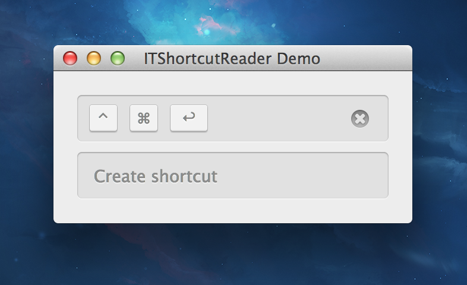

ITShortcutReader
================

`ITShortcutReader` is a simple and beautiful shortcut reader control.

# Note

This project is incomplete. The UI works, but it's not hooked to `MASShortcut`.
If there is interest in this control, I will finish it.

If you are interested, just open an issue.
